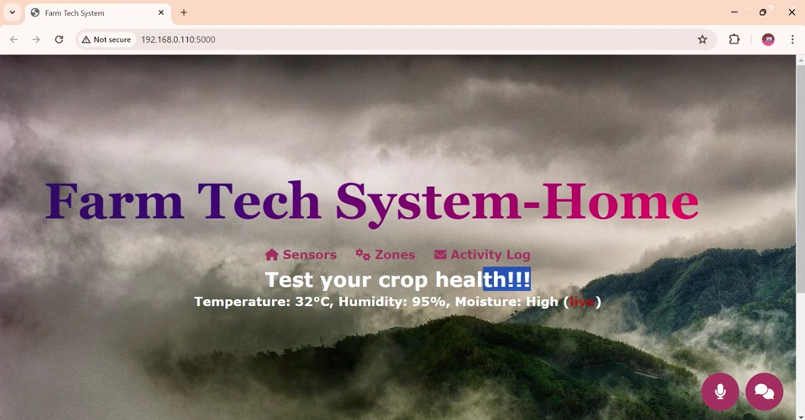
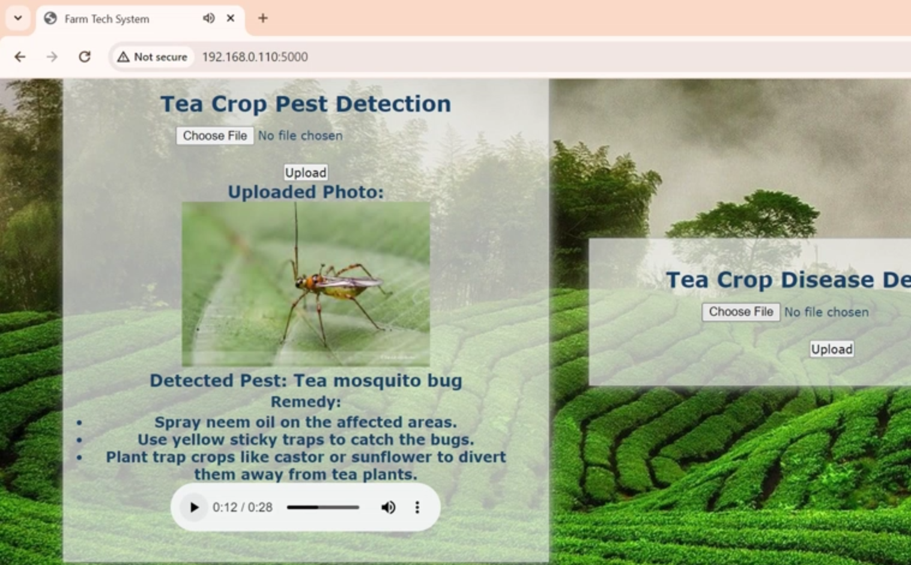

### README.md

# IoT and AI-Powered Smart Agriculture Solution

## Overview

Our innovative solution integrates IoT and AI technologies to address key agricultural challenges such as pests, diseases, and improper fertilization and irrigation. The system features an IoT kit equipped with infrared sensors to detect pests, ultrasonic transducers to repel them, and UV lights to attract pests to sticky traps. Additionally, automated sprinklers are employed to apply neem oil when pests are detected. For disease management, ESP camera modules detect issues early and trigger natural treatments. Environmental sensors continuously monitor soil conditions to optimize irrigation and predict disease outbreaks, while smart fertigation ensures precise fertilizer application. 

A machine learning-enhanced web app identifies pests and diseases from images uploaded by users, providing voice recommendations and actionable insights in the user’s preferred language. An integrated LLM chatbot offers instant agricultural advice, answering farmers' questions and providing timely notifications about new and existing agricultural schemes. This comprehensive approach aims to increase crop yields, improve environmental sustainability, enhance farmer health, and ensure efficient resource use, ultimately supporting sustainable agriculture practices and boosting productivity.

## Features

- **Pest Management**: 
  - Infrared sensors to detect pests.
  - Ultrasonic transducers to repel pests.
  - UV light traps to attract pests to sticky traps.
  - Automated sprinklers that apply neem oil when pests are detected.
  
- **Disease Management**:
  - ESP camera modules for early disease detection.
  - Automated natural treatments triggered by early detection.
  
- **Resource Optimization**:
  - Environmental sensors for continuous soil condition monitoring.
  - Smart irrigation systems to optimize water usage.
  - Smart fertigation for precise fertilizer application.
  
- **ML-Based Identification**:
  - A web app that allows users to upload images for pest and disease identification.
  - Provides voice recommendations and actionable insights in multiple languages.
  
- **LLM Chatbot**:
  - Offers instant agricultural advice.
  - Provides timely notifications about new and existing agricultural schemes.

## Impact

- **Increased Crop Yields and Quality**: By addressing pest and disease issues promptly and efficiently.
- **Improved Environmental Sustainability**: Through the use of eco-friendly pest management and optimized resource use.
- **Enhanced Farmer Health and Safety**: By reducing the need for chemical pesticides and ensuring accurate disease management.
- **Efficient Resource Use**: Precise irrigation and fertigation practices conserve water and fertilizer.
- **Support for Sustainable Agricultural Practices**: The system's comprehensive approach promotes long-term agricultural sustainability.
- **Boosted Productivity and Economic Stability for Farmers**: Improved crop yields and resource management lead to better economic outcomes for farmers.

## Demo Screenshots

Here are some screenshots of our system in action:

*Dashboard showing real-time monitoring and control features.*

*Pest detection interface with infrared sensor data.*

*Disease management interface with ESP camera module data.*

*Environmental sensor data for soil condition monitoring.*

*LLM chatbot providing instant agricultural advice.*

## Model Files

Access the model files through the following link: [Model Files Link](https://drive.google.com/drive/folders/1AS9lIVWEyzMGhODei_se8k2pjCsECadG?usp=sharing)

## Video

Watch our demonstration video here: [Video Link](https://drive.google.com/drive/folders/1tUu5wzGnfmGBTtrPU3Vv9bHlscReXE3W)

## Contact

For more information, please contact us at 22d156@psgitech.ac.in or 6382792828.

Team Neurolingua:
- Roshaun Infant R
- Sharvesh K
- Tiruvikraman V

---

Note: Make sure to place the actual images in the "images" folder within your repository, or adjust the paths accordingly.
